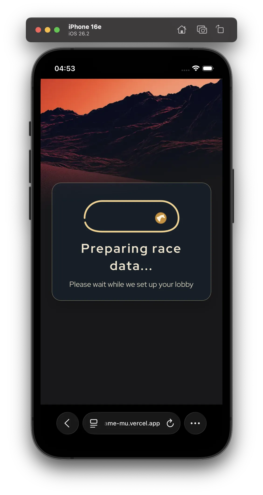
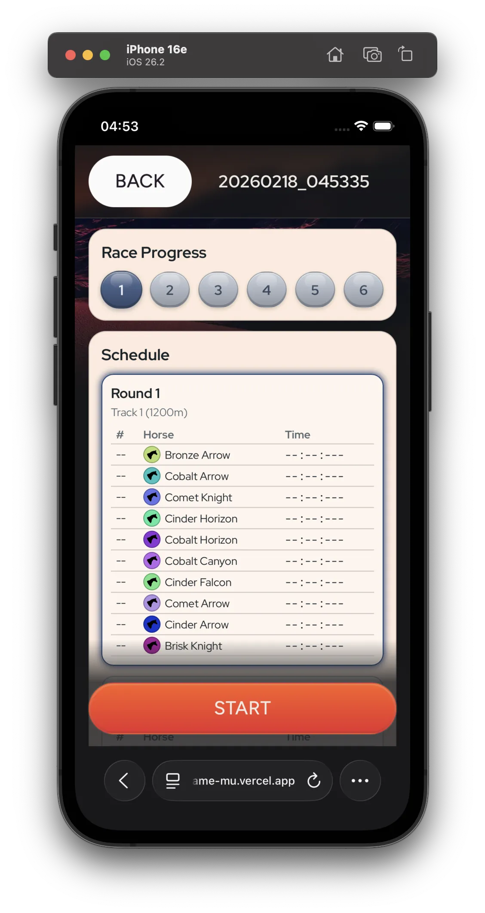
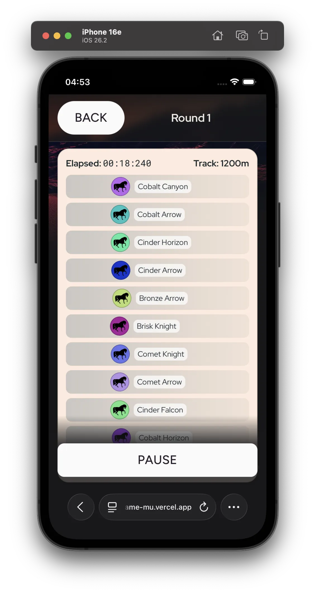
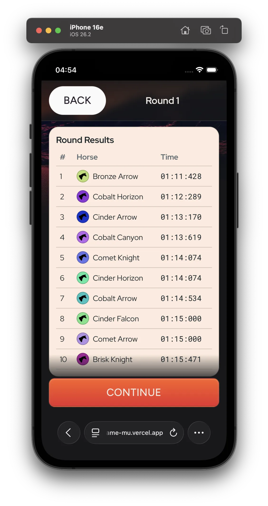
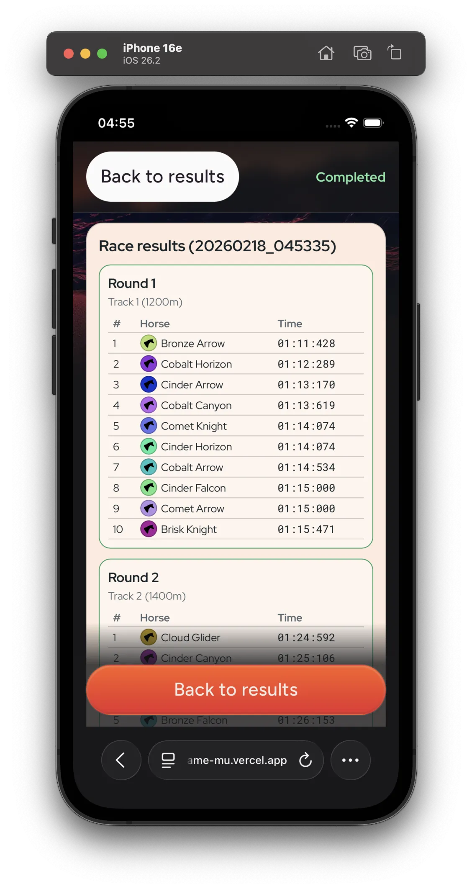
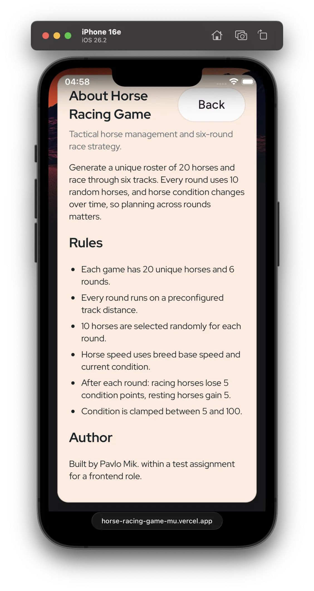

# Horse Racing Game

Horse Racing Game is a mobile-first browser game built with Vue 3 + Vite + TypeScript.
You manage a race series of 6 rounds with 20 unique horses, balancing speed and condition across rounds.

Live version: https://horse-racing-game-mu.vercel.app

## Screenshots

| Loading Screen | Lobby And Schedule | Round Race |
|:---:|:---:|:---:|
|  |  |  |

| Round Results | Race Results | About |
|:---:|:---:|:---:|
|  |  |  |

## Requirements Checklist

### Core Requirements
- ✅ Use Vue.js for implementation (used vue 3).
- ✅ Generate a horse list with randomly generated horses (implemented as exactly `20` horses generated on new race start).
- ✅ Add a `Generate` action that creates a 6-round race schedule (implemented via `NEW GAME`, which generates a new race with 20 horses and a 6-round schedule).
- ✅ Add a `Start` action that runs races one round at a time (implemented as a bottom action button; lobby and round modes are separated, and `START` in lobby runs the next round).
- ✅ Show race results sequentially in the results area as each round finishes (implemented with a reusable round results component: standalone results table at round end, and integrated in lobby as part of the 6-round race results table).
- ✅ Animate horse movement during each round (finish times are precomputed from speed and distance; horses use linear CSS `translateX` animation, encapsulated in a component so the animation engine can be replaced later, simulation time factor is 12 to reduce the waiting time).
- ✅ Keep code clean, modular, and maintainable for large-scale development.

### Rules and Conditions
- ✅ Keep a total pool of 20 horses available for racing.
- ✅ Ensure each horse has a unique color (colors are assigned randomly from a preconfigured pool of 100 unique colors).
- ✅ Keep horse condition score within `1..100` (implemented as `5..100` to preserve a fixed `5`-point step interval, default to `80`).
- ✅ Run exactly 6 rounds per race.
- ✅ Select 10 random horses from the available 20 for each round.
- ✅ Use fixed round distances in order: `1200, 1400, 1600, 1800, 2000, 2200` meters.

### Technical Expectations
- ✅ Implement centralized state management (used Pinia is used instead Vuex).
- ✅ Use component-based design for clear structure and separation of concerns.

### Additional Notes
- ✅ Demonstrate scalable component structure and project organization.
- ✅ Clarified requirements and assumptions before implementation.

### Bonus
- ✅ Unit tests.
- ✅ E2E tests.

### Extra
- ✅ Home screen for simple navigation.
- ✅ Condition delta system: `-5` when horse races, `+5` when horse rests.
- ✅ Horse breeds with base speed range `16..17 m/s` (aligned with real-world average racehorse speed).
- ✅ Auto-save with option to continue an active race.
- ✅ Race history for completed races.
- ✅ Virtual scroll in results list to handle long race history.
- ✅ `PAUSE` / `RESUME` controls during race rounds.
- ✅ Round-state persistence with resume support after tab reload.
- ✅ Separate repository interfaces for active and completed races, making storage replaceable.
- ✅ Storage split: `localStorage` for active race, `IndexedDB` for completed races.
- ✅ Responsive design and reusable color variables.
- ✅ Localization (English locale for now).

## Gameplay Summary

- Each game generates 20 unique horses.
- Every horse has a unique name, unique breed, and unique color.
- Every game contains 6 rounds on fixed tracks in this order:
  ```
  Track 1: 1200m
  Track 2: 1400m
  Track 3: 1600m
  Track 4: 1800m
  Track 5: 2000m
  Track 6: 2200m
  ```
- Each round randomly selects 10 horses from the 20.
- Horse speed formula:
  - `speed = baseSpeed - (1 - condition / 100)`
- Round time formula:
  - `timeMs = (distance / speed) * 1000`
  - `amimationDuration = timeMs / SIMULATION_TIME_SCALE`
- Condition update after each completed round (when returning to lobby):
  - Horse that raced: `-5`
  - Horse that rested: `+5`
  - Condition is clamped to `5..100`

## Screens

- `/` Main menu:
  - Shows loading splash before menu (`MIN_LOADING_TIME_MS` is used to make the splash visible even on fast loads)
  - `NEW GAME` (warns before replacing active game)
  - `CONTINUE` (disabled without active game)
  - `RESULTS` (always enabled, shows empty state when no completed races)
  - `ABOUT`
- `/race/:id` Active race screen:
  - Lobby phase with race progress line, horse table, and schedule cards
  - Round simulation phase with pause/resume
- `/results` Completed games list
- `/results/:id` Completed race details (read-only race view)
- `/about` Rules and project info

## Race Persistence Flow

- Active race is auto-saved with debounce while race data changes
- Reloading during an in-progress round restores the race in paused state
- Completed race is moved to completed storage and active snapshot is cleared

## Persistence

- Active game: `localStorage`
- Completed games: `indexedDB`
- If IndexedDB is unavailable, completed races fall back to `localStorage`

## Tech Stack

- Node `22.x` (see `.nvmrc`)
- PNPM
- Vite + Vue 3 (Composition API, SFC, `<script setup>`)
- Pinia
- Vue Router
- Vue I18n (English)
- VueUse
- Anime.js (used for loading screens)
- Sentry (`VITE_SENTRY_DSN`)
- Vitest (unit)
- Playwright (e2e)
- ESLint

## Quick Start

```bash
nvm use
pnpm install
pnpm dev
```

Open: `http://localhost:5173`

## Quality Checks

```bash
pnpm lint
pnpm typecheck
pnpm test:unit
pnpm test:e2e
pnpm check
pnpm check:full
pnpm build
```

## Deploy to Vercel

This project is ready for static deployment.

- Build command: `pnpm build`
- Output directory: `dist`
- `vercel.json` is included to rewrite SPA routes to `index.html`

## Environment Variables

Create `.env` (optional):

```bash
VITE_SENTRY_DSN=
```
